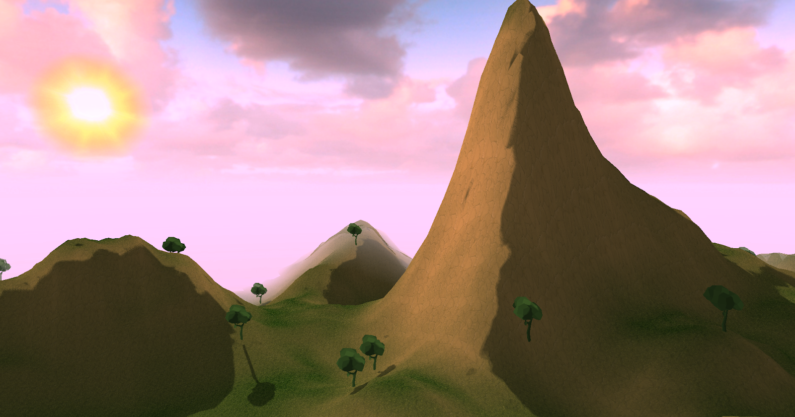

Mountain Landscape Procedural Generation Simulator
===========================

This project demonstrates a world with procedural generation, where the user can change procedural factors (frequency, amplitude, and octaves) in real time using the keyboard. 

The world is a mountain landscape, with grass, trees, cliffs, and an movable sun.

Build Instructions (Windows)
------------

Download visual studio: https://visualstudio.microsoft.com/  

Download OpenGL, GLM, and GLFW. I have a version of this dependency in my repository called 'OpenGL-Dependency' which can be used if need be

Clone repo and open "program2b.sln" file with visual studio. Build and run.

Controls
--------

w, a, s, d : move  
i, k : tilt camera up and down  
e, r : move sun  
f, v : increase/decrease world frequency  
g, b : increase/decrease world amplitude  
h, n : increment/decrement world octaves  

Technical Features
------------------

Tessellation   
Shadow Mapping  
Normal Calulation  
Random Object Placement  
